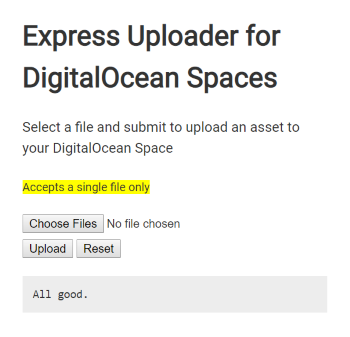

# Typescript, Express and DigitalOcean Spaces

Upload files to DigitalOcean Spaces using Express.js and Typescript



## Getting Started

### Install

After you cloned the repo, enter the directory and install node dependencies

```
npm run install
```

### Create .env file

make sure to create an .env file on the root directory with the following variables

```
DO_SPACES_ENDPOINT=
DO_SPACES_KEY=
DO_SPACES_SECRET=
DO_SPACES_BUCKET=
```

`PORT` variable is optional

### Serve

To run the server run the next command on the console

```
npm run serve
```

## Built With

- [AWS SDK](https://aws.amazon.com/sdk-for-node-js/) - AWS SDK for JavaScript in Node.js
- [Multer](https://github.com/expressjs/multer) - Node.js middleware for handling multipart/form-data
- [Multer S3](https://github.com/badunk/multer-S3) - Multer storage engine for amazon S3

## Contributing

Feel free to fork this repo and share feedback

## License

This project is licensed under the MIT License
